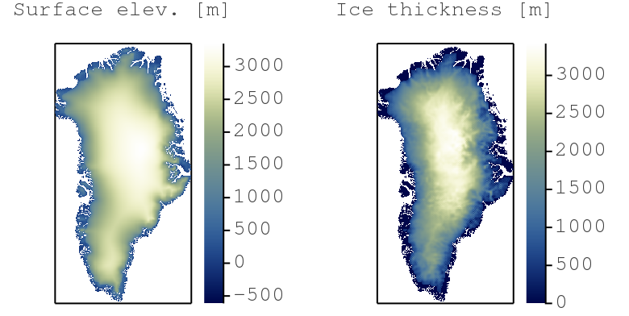

# julia-parallel-course-EGU21

#### [vEGU2021: SC4.6 Solving differential equations in parallel with Julia | Thu, 29 Apr, 16:00–17:00 (CEST)](https://meetingorganizer.copernicus.org/EGU21/session/38986)

👉 **Organisation notes:**
- 💡 All material presented during the short course will be uploaded here and made available to participants 5 days prior to the event on this repository.
- ⚠️ Live participation to this short course requires [registration to EGU's main meeting](https://egu21.eu/register.html).
- Due to the time-limited course schedule (60 min), an interactive overview will cover the course's [objectives](#objectives) replacing an extensive hands-on.
- Further interests in solving PDEs with Julia on GPUs❓Sign-up (free) for a hands-on workshop at [JuliaCon2021](https://juliacon.org/2021/).

----
This short course covers trendy areas in modern geocomputing with broad geoscientific applications. The physical processes governing natural systems' evolution are often mathematically described as systems of differential equations. A performant numerical implementation of the solving algorithm leveraging modern hardware is key and permits to tackle problems that were technically not possible a decade ago.

## Content
* [Objectives](#objectives)
* [Structure of the repo](#structure-of-the-repo)
* [Getting started](#getting-started)
* [Short course - Part 1](#short-course-part-1)
    * [Step 1](#step-1)
    * [Step 2](#step-2)
* [Short course - Part 2](#short-course-part-2)
    * [Step 1](#step-1)
    * [Step 2](#step-2)
* [Extras](#extras)
* [References](#references)

## Objectives
The goal of this short course is to offer an interactive overview on how to solve systems of differential equations in parallel on GPUs using the [Julia language]. [Julia] combines high-level language simplicity and low-level language performance. The resulting codes and applications are fast, short and readable. We will design and implement a numerical algorithm that predicts ice flow dynamics over mountainous topography (Greenland) using a high-performance computing approach:

The online course consists of 2 parts:
1. You will learn about the [Julia language], parallel and distributed computing and iterative solvers.
2. You will implement a PDE solver to predict ice flow dynamics on real topography.

By the end of this short course, you will:
- Have a GPU PDE solver that predicts ice-flow;
- Have a Julia code that achieves similar performance than legacy codes (C, CUDA, MPI);
- Know how the Julia language solves the "two-language problem";
- Be able to leverage the computing power of modern GPU accelerated servers and supercomputers.

⤴️ [_back to content_](#content)

## Structure of the repo
The course repository lists following folders and items:
- the [data](data) folder contains various low resolution Greenland input data (bedrock topography, surface elevation, ice thickness, masks, ...) downscaled from [BedMachine Greenland v3] - note the filenames include grid resolution information `(nx, ny)`;
- the [docs](docs) folder contains documentation linked in the [README](README.md);
- the [output](output) folder contains the various code output, mainly figures in png format;
- the [scripts](scripts) folder contains the scripts this course is about 🎉
- the [`Manifest.toml`](Manifest.toml) and [`Project.toml`](Project.toml) files are Julia project files tracking the used packages and enabling a reproducible environment.

⤴️ [_back to content_](#content)

## Getting started
The here detailed directions will get you started with setting up your local [Julia] environment. Two configurations are presented: 
- running Julia from the [terminal with an external text editor](#terminal--external-editor)
- running Julia from [VS code](#vs-code)

### Terminal + external editor

### VS code

⤴️ [_back to content_](#content)

## Short course - Part 1

### Step 1

### Step 2

⤴️ [_back to content_](#content)

## Short course - Part 2

### Step 1

### Step 2

⤴️ [_back to content_](#content)

## Extras

⤴️ [_back to content_](#content)

## References

⤴️ [_back to content_](#content)

[Julia]: https://julialang.org
[Julia language]: https://docs.julialang.org/en/v1/

[BedMachine Greenland v3]: https://sites.uci.edu/morlighem/dataproducts/bedmachine-greenland/
