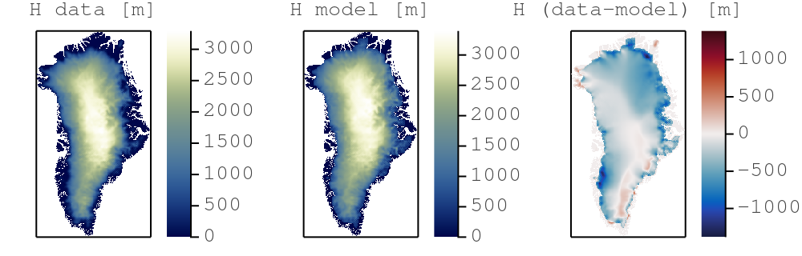
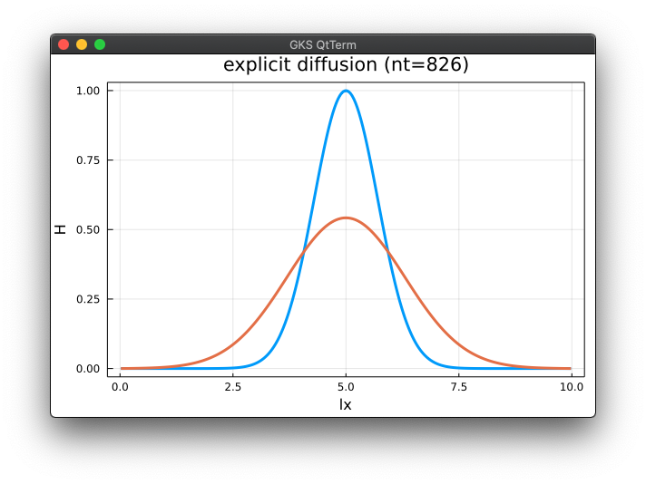
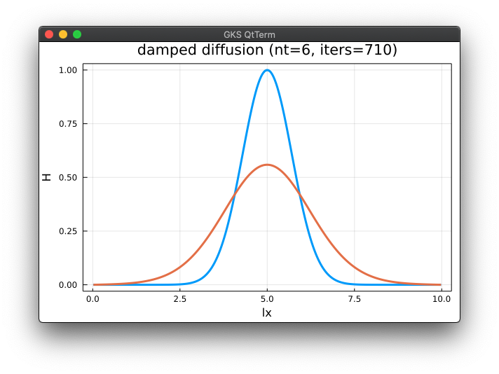

# julia-parallel-course-EGU21

#### [vEGU2021: SC4.6 Solving differential equations in parallel with Julia | Thu, 29 Apr, 16:00–17:00 (CEST)](https://meetingorganizer.copernicus.org/EGU21/session/38986)

👉 **Organisation notes:**
- 💡 All material presented during the short course will be uploaded here and made available to participants 5 days prior to the event on this repository.
- ⚠️ Live participation to this short course requires [registration to EGU's main meeting](https://egu21.eu/register.html).
- Due to the time-limited course schedule (60 min), an interactive overview will cover the course's [objectives](#objectives) replacing an extensive hands-on.
- Further interests in solving PDEs with Julia on GPUs❓Sign-up (free) for a hands-on workshop at [JuliaCon2021](https://juliacon.org/2021/).

----
This short course covers trendy areas in modern geocomputing with broad geoscientific applications. The physical processes governing natural systems' evolution are often mathematically described as systems of differential equations. A performant numerical implementation of the solving algorithm leveraging modern hardware is key and permits to tackle problems that were technically not possible a decade ago.


## Content
* [Objectives](#objectives)
* [Structure of the repository](#structure-of-the-repository)
* [Getting started](#getting-started) (_not part of the live course_)
* 👉 [Short course material](#short-course-material)
* [Extras](#extras)
* [Further reading](#further-reading)


## Objectives
The goal of this short course is to offer an interactive overview on how to solve systems of differential equations in parallel on GPUs using the [Julia language]. [Julia] combines high-level language simplicity and low-level language performance. The resulting codes and applications are fast, short and readable \[[1][JuliaCon20a], [2][JuliaCon20b], [3][JuliaCon19]\]. We will design and implement a numerical algorithm that predicts ice flow dynamics over mountainous topography (Greenland) using a high-performance computing approach:


The online course consists of 2 parts:
1. You will learn about the [Julia language], parallel and distributed computing and iterative solvers.
2. You will implement a PDE solver to predict ice flow dynamics on real topography.

By the end of this short course, you will:
- Have a GPU PDE solver that predicts ice-flow;
- Have a Julia code that achieves similar performance than legacy codes (C, CUDA, MPI);
- Know how the Julia language solves the "two-language problem";
- Be able to leverage the computing power of modern GPU accelerated servers and supercomputers.

⤴️ [_back to content_](#content)

## Structure of the repository
The course repository lists following folders and items:
- the [data](data) folder contains various low resolution Greenland input data (bedrock topography, surface elevation, ice thickness, masks, ...) downscaled from [BedMachine Greenland v3] - note the filenames include grid resolution information `(nx, ny)`;
- the [docs](docs) folder contains documentation linked in the [README](README.md);
- the output folder _will_ contain the various code output, mainly figures in png format;
- the [scripts](scripts) folder contains the scripts this course is about 🎉
- the [`Project.toml`](Project.toml) file is a Julia project file, tracking the used packages and enabling a reproducible environment.

⤴️ [_back to content_](#content)

## Getting started
> ⚠️ Due to the time limitation, the short course will not cover the [Getting started](#getting-started) steps. These are meant to provide directions to the participant willing to actively try out the examples during the short course. It is warmly recommended to perform the [Getting started](#getting-started) steps before the beginning of the workshop.

The provided directions will get you started with:
1. [Installing Julia](#installing-julia) - 2 configurations are suggested:
- running Julia from the [terminal with an external text editor](#terminal--external-editor)
- running Julia from [VS Code](#vs-code)

2. [Running the scripts](#running-the-scripts) from the course repository.

> 👉 _Note: This course relies on Julia v1.5.X. The install configuration are tested on a MacBook Pro running macOS 10.15.7 and a Linux GPU server running Ubuntu 20.04 LTS._

### Installing Julia
Check you have an active internet connexion, head to https://julialang.org/downloads/ and download Julia v1.5.4 for your platform following the install directions provided under [help] if needed.

Alternatively, open a terminal and download the binaries (select the one for your platform):
```sh
wget https://julialang-s3.julialang.org/bin/winnt/x64/1.5/julia-1.5.4-win64.exe # Windows
wget https://julialang-s3.julialang.org/bin/mac/x64/1.5/julia-1.5.4-mac64.dmg # macOS
wget https://julialang-s3.julialang.org/bin/linux/x64/1.5/julia-1.5.4-linux-x86_64.tar.gz # Linux x86
tar -xzf julia-1.5.4-<win64, mac64, linux-x86_64>.tar.gz # selecting your platform
```
Then add following lines in your `.bashrc`, `.profile`, or `config` file:
```sh
vim ~/.bashrc
PATH=<path-to>/julia-1.5.4/bin/:$PATH
export JULIA_CUDA_USE_BINARYBUILDER=false
```

#### Terminal + external editor
Ensure you have a text editor with syntax highlighting support for Julia. From within the terminal, type
```sh
julia
```
and you should be all set.

#### VS Code
If you'd enjoy a more IDE type of environment, [check out VS Code](https://code.visualstudio.com). Follow the [installation directions](https://github.com/julia-vscode/julia-vscode#getting-started) for the [Julia VS Code extension](https://www.julia-vscode.org).

### Running the scripts
To get started with the course,
1. clone (or download the ZIP archive) the course repository ([help here](https://docs.github.com/en/github/creating-cloning-and-archiving-repositories/cloning-a-repository))
```sh
git clone https://github.com/luraess/julia-parallel-course-EGU21.git
```
2. Navigate to `julia-parallel-course-EGU21`
```sh
cd julia-parallel-course-EGU21
```
3. From the terminal, launch Julia with the `--project` flag to read-in project environment related informations such as used packages
```sh
julia --project
```
3. From VS Code, follow the [instructions from the documentation](https://www.julia-vscode.org/docs/stable/gettingstarted/) to get started.

--

Now that you launched Julia, you should be in the [Julia REPL]. We now need to ensure all the packages we need to be installed before using them. To do so, enter the [Pkg mode](https://docs.julialang.org/en/v1/stdlib/REPL/#Pkg-mode) by typing `]`. Then, instantiate the project which should trigger the download of the packages. Exit the Pkg mode with CRTL+C:
```julia-repl
julia> ]

(julia-parallel-course-EGU21) pkg> st
Status `~/julia-parallel-course-EGU21/Project.toml`
  [4138dd39] JLD
  [85f8d34a] NCDatasets
  [91a5bcdd] Plots
  [de0858da] Printf

(julia-parallel-course-EGU21) pkg> instantiate
   Updating registry at `~/.julia/registries/General`
   Updating git-repo `https://github.com/JuliaRegistries/General.git`
   # [...]

julia>
```
To test your install, go to the [scripts](scripts) folder and run the [`iceflow.jl`](scripts/iceflow.jl) code. Note that you can execute shell commands from within the [Julia REPL] first typing `;`:
```julia-repl
julia> ;

shell> cd scripts/

julia> include("iceflow.jl")
```
Running this the first time will (pre-)complie the various installed packages and will take some time.  Subsequent runs, by executing `include("iceflow.jl")`, should take around 10s.

You should then see two figures saved in a newly created output folder, the second being the comparison between modelled and observed ice thickness distribution over Greenland:



### Running on GPUs

Some infos on Nvidia CUDA and JuliaGPU and CUDA.jl here.

⤴️ [_back to content_](#content)

## Short course material
This section lists the material discussed within this 60 min. short course:
* [Part 1 - Julia, parallel computing, iterative solvers](#part-1---julia-parallel-computing-iterative-solvers)
    * [Why Julia](#why-julia)
    * [Diffusion processes](#diffusion-processes)
    * [Iterative solvers](#iterative-solvers)
    * [Parallel GPU computing](#parallel-gpu-computing)
    * [Performance metric](#performance-metric)
* [Part 2 - solving PDEs to predict ice flow](#part-2---solving-pdes-to-predict-ice-flow)
    * [SIA equation](#sia-equation)
    * [Step 4](#step-4)

In this course we will implement a 2D nonlinear diffusion equation in Julia using the finite-difference method and an iterative solving approach to resolve a the shallow ice approximation (SIA) and predict ice flow over Greenland.

### Part 1 - Julia, parallel computing, iterative solvers

#### Why Julia
_by M. Werder_
- the cool Julia ecosystem
- git integration
- modern code dev and CI
- ...

#### Diffusion processes
Let's implement a simple 1D linear diffusion example to understand what's all about and use it as example to compare the serial CPU vs the parallel GPU implementation. The diffusion of a quantity `H` over time `t` can be described as (1a) a diffusive flux, (1b) a balance of flux and (1c) an update rule:
```md
qH    = -D*dH/dx  (1a)
dHdt  =  -dqH/dx  (1b)
dH/dt = dHdt      (1c)
```
The [`diffusion_1D_expl.jl`](scripts/diffusion_1D_expl.jl) code implements an iterative and explicit solution to eq. (1). 



How to go with an implicit solution _**and**_ keeping it iterative ?

#### Iterative solvers
The [`diffusion_1D_impl.jl`](scripts/diffusion_1D_impl.jl) code implements an iterative implicit solution to eq. (1). How ? We add the physical time derivative to the rate of change `dHdt` and iterate until the values of `dHdt` drop below a defined tolerance level `epsi`.


It seems to work, but the iteration count seems to be pretty high (`niter>1000`). There is a simple way to circumvent this by adding "damping" to the rate-of-change, analogous to adding friction to the rate of change to enable faster convergence. The [`diffusion_1D_damp.jl`](scripts/diffusion_1D_damp.jl) code implements a damped iterative implicit solution to eq. (1). The iteration count dropped to `niter<100`.



#### Parallel GPU computing
So now we have a cool iterative and implicit solver in about 30 lines of code 🎉. Good enough for low resolution and 1D calculations. What if we need more - 2D, 3D and 6K resolution to capture highly local physics ? Parallel and GPU computing makes it possible. Let's take the [`diffusion_1D_damp.jl`](scripts/diffusion_1D_damp.jl) code and port it to GPU (with some intermediate steps).

1. Extract the physics calculations from [`diffusion_1D_damp.jl`](scripts/diffusion_1D_damp.jl)
```julia
qH         .= -D*diff(H)/dx
dHdt       .= -(H[2:end-1].-Hold[2:end-1])/dt .-diff(qH)/dx .+ damp*dHdt
H[2:end-1] .= H[2:end-1] .+ dtau*dHdt
```

2. Split the calculations into separate functions (or kernels). The [`diffusion_1D_damp_fun.jl`](scripts/diffusion_1D_damp_fun.jl) implements those modifications.
```julia
function compute_flux!(qH, H, D, dx, nx)
    Threads.@threads for ix=1:nx
        if (ix<=nx-1)  qH[ix] = -D*(H[ix+1]-H[ix])/dx  end
    end
    return
end

function compute_rate!(dHdt, H, Hold, qH, dt, damp, dx, nx)
    Threads.@threads for ix=1:nx
        if (2<=ix<=nx-1)  dHdt[ix-1] = -(H[ix] - Hold[ix])/dt -(qH[ix]-qH[ix-1])/dx + damp*dHdt[ix-1]  end
    end
    return
end

function compute_update!(H, dHdt, dtau, nx)
    Threads.@threads for ix=1:nx
        if (2<=ix<=nx-1)  H[ix] = H[ix] + dtau*dHdt[ix-1]  end
    end
    return
end
```

3. Replace the (multi-threaded) loop by a vectorised index. The [`diffusion_1D_damp_gpu.jl`](scripts/diffusion_1D_damp_gpu.jl) implements those modifications to run on GPUs.
```julia
function compute_flux!(qH, H, D, dx, nx)
    ix = (blockIdx().x-1) * blockDim().x + threadIdx().x
    if (ix<=nx-1)  qH[ix] = -D*(H[ix+1]-H[ix])/dx  end
    return
end

function compute_rate!(dHdt, H, Hold, qH, dt, damp, dx, nx)
    ix = (blockIdx().x-1) * blockDim().x + threadIdx().x
    if (2<=ix<=nx-1)  dHdt[ix-1] = -(H[ix] - Hold[ix])/dt -(qH[ix]-qH[ix-1])/dx + damp*dHdt[ix-1]  end
    return
end

function compute_update!(H, dHdt, dtau, nx)
    ix = (blockIdx().x-1) * blockDim().x + threadIdx().x
    if (2<=ix<=nx-1)  H[ix] = H[ix] + dtau*dHdt[ix-1]  end
    return
end
```


#### Performance metric


⤴️ [_back to course material_](#short-course-material)

### Part 2 - solving PDEs to predict ice flow

#### SIA equation


#### Step 4

⤴️ [_back to course material_](#short-course-material)


## Extras


⤴️ [_back to content_](#content)


## Further reading
\[1\] [Omlin, S., Räss, L., Kwasniewski, G., Malvoisin, B., & Podladchikov, Y. Y. (2020). Solving Nonlinear Multi-Physics on GPU Supercomputers with Julia. JuliaCon Conference, virtual.][JuliaCon20a]

\[2\] [Räss, L., Reuber, G., Omlin, S. (2020). Multi-Physics 3-D Inversion on GPU Supercomputers with Julia. JuliaCon Conference, virtual.][JuliaCon20b]

\[3\] [Räss, L., Omlin, S., & Podladchikov, Y. Y. (2019). Porting a Massively Parallel Multi-GPU Application to Julia: a 3-D Nonlinear Multi-Physics Flow Solver. JuliaCon Conference, Baltimore, USA.][JuliaCon19]

\[4\] [Frankel, S. P. (1950). Convergence rates of iterative treatments of partial differential equations, Mathe. Tables Other Aids Comput., 4, 65–75.][Frankel50]

⤴️ [_back to content_](#content)


[Julia]: https://julialang.org
[Julia language]: https://docs.julialang.org/en/v1/
[Julia REPL]: https://docs.julialang.org/en/v1/stdlib/REPL/

[BedMachine Greenland v3]: https://sites.uci.edu/morlighem/dataproducts/bedmachine-greenland/

[JuliaCon20a]: https://www.youtube.com/watch?v=vPsfZUqI4_0
[JuliaCon20b]: https://www.youtube.com/watch?v=1t1AKnnGRqA
[JuliaCon19]: https://www.youtube.com/watch?v=b90qqbYJ58Q
[Frankel50]: /docs/frankel_1950.pdf
